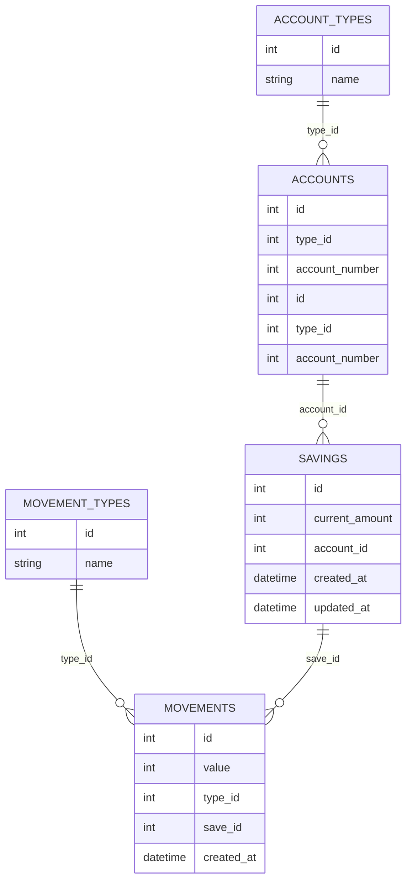

# Autotaxis Bolivar
- [Autotaxis Bolivar](#autotaxis-bolivar)
  - [Caso problema](#caso-problema)
  - [Brief](#brief)
    - [Exploración de la Estructura de Datos y Diseño Inicial](#exploración-de-la-estructura-de-datos-y-diseño-inicial)
    - [Motor de Base de datos](#motor-de-base-de-datos)
    - [Investigación de Modelos de IA y Análisis Predictivo](#investigación-de-modelos-de-ia-y-análisis-predictivo)
    - [Diseño de la Interfaz de Usuario y Gestión de Fondos](#diseño-de-la-interfaz-de-usuario-y-gestión-de-fondos)
    - [Explicación:](#explicación)
  - [POC](#poc)
    - [Stack tecnológico](#stack-tecnológico)
      - [Flutter - mobile](#flutter---mobile)
      - [Backend - nodejs](#backend---nodejs)
  - [Referencias](#referencias)

## Caso problema
Crear una aplicación móvil que permita recopilar información de forma ágil y automatizada.

## Brief

### Exploración de la Estructura de Datos y Diseño Inicial
- Identificar las fuentes de datos clave relacionadas con los usuarios, fondos y transacciones.
> Al buscar tener una solución formal,y contar con una aplicación existente se busca que los usuarios no requieran un registro adicional. los clientes ya cuentan con unos fondos que provienen de cuentas de ahorros o cuentas corrientes.

- Explorar las mejores prácticas para la gestión y almacenamiento seguro de datos de ahorro y comportamiento de pago.
> todas las operaciones relacionadas con la natillera deben velar por cumplir con el conjunto de propiedades ACID con esto se busca garantizan que las transacciones en una base de datos se procesen de manera confiable.representando:

    1. Atomicidad (Atomicity): Una transacción se considera una unidad indivisible. O se completan todas las operaciones de la transacción, o ninguna. Si alguna operación falla, la transacción completa se revierte.

    2. Consistencia (Consistency): Una transacción lleva la base de datos de un estado válido a otro estado válido. Esto significa que cualquier dato escrito en la base de datos debe cumplir con todas las reglas definidas, como restricciones, disparadores, etc.

    3. Aislamiento (Isolation): Las transacciones concurrentes se ejecutan de manera que no interfieran entre sí. Los cambios realizados en una transacción no son visibles para otras transacciones hasta que se completen.

    4. Durabilidad (Durability): Una vez que una transacción se ha completado, sus cambios son permanentes, incluso en caso de fallos del sistema.

> Estas propiedades son fundamentales para garantizar la integridad y confiabilidad de las operaciones en bases de datos.

- Diseñar el esquema inicial de la base de datos para la gestión de usuarios, fondos y transacciones.

### Motor de Base de datos

PostgreSQL es una de las bases de datos relacionales más robustas y avanzadas que existen, y es particularmente conocida por cumplir con el modelo ACID, lo que la hace adecuada para aplicaciones que requieren transacciones seguras y consistentes.

PostgreSQL es open-source y tiene una licencia muy permisiva, lo que significa que puedes usarla, modificarla y distribuirla libremente, sin costos adicionales. Esto es una ventaja que la hace costo eficiente.

### Investigación de Modelos de IA y Análisis Predictivo
> Los modelos predictivos del banco basada en la información de consumo, ahorro e ingresos de los diferentes clientes pueden ayudar a identificar la capacidad que un cliente puede permitirse ahorrar mensualmente y que pueda ayudar a cumplir con los objetivos de navidad.

### Diseño de la Interfaz de Usuario y Gestión de Fondos

- Explorar las mejores opciones para diseñar una interfaz de usuario (UI) intuitiva y fácil de usar para la captura de información. al orientar la solución a conductores los botones deben de ser de gran tamaño  y con grandes espaciados para presionar los botones sin perder capacidad de reacción a la hora de conducir. también debe tener permisos al GPS para capturar la información necesaria referente a geoposicion sin necesidad de intervención humana, la captura de voz es otro insumo valioso que podría ayudar a diligenciar información con menor fricción.

### Explicación:
- **Splash Screen**: Punto de inicio de la aplicación donde se cargan variables y configuraciones propias de la aplicación, también se hacen validaciones necesarias como actualizaciones requeridas.
- **Home Screen**: Punto de inicio del cliente, en este punto el usuario puede revisar las diferentes opciones que tiene el usuario.
- **Login Page**: Pantalla para iniciar sesión con el motor de autenticación de la empresa.
- **Home Screen Authenticated**: Página principal tras un inicio de sesión exitoso.
- **Maintenance Page**: Permite consultar los mantenimientos del vehiculo.
- **Logout**: Permite al usuario salir y regresar a la pantalla principal.

## POC

### Stack tecnológico

#### Flutter - mobile
Flutter ofrece varias ventajas para el desarrollo de soluciones móviles:

- Desarrollo Multiplataforma: Con Flutter, puedes crear aplicaciones para iOS y Android utilizando una única base de código, lo que reduce significativamente el tiempo y los costos de desarrollo.

- Rendimiento Nativo: Flutter compila directamente a código nativo, lo que permite un rendimiento cercano al de las aplicaciones nativas.

- Hot Reload: Esta característica permite ver los cambios en el código de inmediato sin necesidad de reiniciar la aplicación, lo que acelera el proceso de desarrollo y depuración.

- UI Personalizable y Rica: Flutter proporciona una amplia gama de widgets personalizables que permiten crear interfaces de usuario atractivas y consistentes en ambas plataformas.

- Comunidad y Soporte: Flutter cuenta con una comunidad activa y en crecimiento, además de ser respaldado por Google, lo que asegura un soporte continuo y la evolución de la plataforma.

- Integración con Código Nativo: Flutter permite integrar fácilmente código nativo de iOS y Android, lo que facilita el uso de funcionalidades específicas de cada plataforma.

- Documentación Completa: La documentación de Flutter es extensa y bien organizada, lo que facilita el aprendizaje y la resolución de problemas.

Algunos referentes de multiples sectores de la industria hace uso de este stack para sus desarrollos tecnológicos, desde la banca hasta el sector automotriz.

#### Backend - nodejs

En aras del tiempo nodejs es el stack elegido por que 

- Desarrollo Rápido: Gracias a su naturaleza asincrónica y a la gran cantidad de módulos disponibles, el desarrollo con Node.js puede ser más rápido en comparación con otras tecnologías.

Sin embargo estas son otras caracteristicas a destacar: 

- JavaScript en el Servidor: Node.js permite utilizar JavaScript tanto en el frontend como en el backend, lo que facilita la unificación del stack de desarrollo y la reutilización de código.

- Asincronía y No Bloqueante: Node.js utiliza un modelo de E/S no bloqueante y basado en eventos, lo que permite manejar múltiples conexiones simultáneamente con un alto rendimiento y eficiencia.

- Gran Ecosistema de Módulos: Node.js cuenta con npm (Node Package Manager), el cual ofrece una vasta colección de paquetes y módulos que pueden ser fácilmente integrados en las aplicaciones, acelerando el desarrollo.

- Escalabilidad: Node.js es ideal para aplicaciones escalables y de alto rendimiento, como aplicaciones en tiempo real (chat, juegos en línea) y APIs RESTful.

- Comunidad Activa: Node.js tiene una comunidad grande y activa que contribuye continuamente con mejoras, módulos y soporte, lo que facilita la resolución de problemas y la evolución de la plataforma.

- JSON Nativo: Node.js maneja JSON de manera nativa, lo que es ideal para el intercambio de datos entre el servidor y el cliente, especialmente en aplicaciones web modernas.

Microservicios: Node.js es una excelente opción para arquitecturas de microservicios debido a su capacidad para manejar múltiples servicios pequeños y su facilidad de integración con otras tecnologías.

Soporte para Herramientas Modernas: Node.js es compatible con muchas herramientas modernas de desarrollo y despliegue, como Docker, Kubernetes, y CI/CD pipelines, lo que facilita la implementación y el mantenimiento de aplicaciones.

Rendimiento: Gracias a su motor V8 de Google, Node.js ofrece un rendimiento rápido y eficiente, lo que es crucial para aplicaciones que requieren alta velocidad y capacidad de respuesta.
## Referencias
- [Flutter - Nubank usecase](https://flutter.dev/showcase/nubank)
- [Flutter - Toyota usecase](https://flutter.dev/showcase/toyota)
- [ACID Properties in Database Management Systems](https://www.mongodb.com/resources/basics/databases/acid-transactions)
- [Coperativa rereferencia - Ahorro natillero](https://fec.com.co/planes-de-ahorro/ahorro-natillero-natillerito)